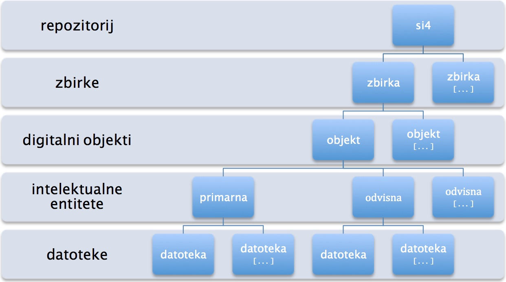

# Primeri za si4 repozitorij

## Podatkovni model repozitorija si4

* **Digital Object**: Digitalni objekt ima eno ali več intelektualnih entitet:
    * **Intelectual Entity**: Intelektualna entiteta digitalnega objekta se deli na:
        * **Primary**: Izhodiščno primarno intelektualno entiteto: lahko vsebuje eno ali več odvisnih intelektualnih entitet, sama pa ne sme biti odvisna od druge intelektualne entitete.
        * **Dependent**: Odvisna intelektualna entiteta, ki se navezuje na drugo intelektualno entiteto, sama pa ima lahko tudi druge odvisne intelektualne entitete
    * **File**: Intelektualne entitete imajo lahko eno ali več datotek.
* **Collection**: Objekti so nujno vključeni v eno od zbirk digitalnih objektov. Zbirka ima enega ali več digitalnih objektov. Relacija med zbirko in digitalnim objektom je vedno samo relacija med zbirko in primerno intelektualno entiteto.



Metapodatki za upravljanje enot podatkovnega modela repozitorija si4 se upravlja v mets.xml datotekah za:

* zbirke (collection),
* intelektualne entitete (entity) in
* datoteke (file).

## Identifikatorji in tipi v mets.xml za vse enote podatkovnega modela si4

**Opomba:** Elementi in atributi iz mets.xml datotek so določeni z XPath izrazi.

Vrednost atributa METS:mets/@TYPE določa vrsto enot podatkovnega modela:

* **Zbirka** je **vedno** označeno z vrednostjo **collection**.
* **Datoteka** je **vedno** označena z vrednostjo **file**.
* **Entiteta** je **lahko** označena z vrednostjo **entity**:
    * **entity** je **privzeta vrednost** za entiteto, ki označuje privzeti **Dublin Core metapodatkovni model**,
    * namesto privzetega metapodatkovnega modela ima lahko entiteta **dodaten metapodatkovni model**,
    * dodatne metapodatkovne modele označujemo s poljubno alternativno vrednostjo atributa @TYPE, npr.
        * **journal** za znanstvene revije (MODS metapodatkovni standard),
        * **monography** za znanstvene monografije in zbornike (MODS metapodatkovni standard),
        * **data** za raziskovalne podatke (OpenAire metapodatkovni standard),
        * po dogovoru še druge poljubne vrednosti.
        
**Metapodatkovni model za zbirke**: Za razliko od metapodatkovenga modela za
entiteto, ki velja samo za posamezno entiteto, velja metapodatkovni model zbirke
za vse entitete te zbirke. Ta metapodatkovni model zbirk se uporablja pri prikazi
celotne zbirke (menujski pogled) in iskanju samo po tej zbirki.
Vendar je pri tem potrebno paziti, da ne bi prihajalo do konfliktov med potencialno
različnima metapodatkovnima modeloma zbirk in njihovih entitet
(sorodni metapodatkovni modeli). Metapodatkovni model zbirke se v mets.xml zapiše
(prevzeta vrednost **collection**, ostale vrednosti kot pri entiteti) v
```
/METS:mets/METS:behaviorSec[@TYPE='default.behavior']/METS:behavior/@BTYPE
```

Vsaka entiteta, zbirka in datoteka ima dva identifikatorja:

* **Local name** identifikator: poljubni Unicode UCS-2 znaki:
  * pri prenosu podatkov iz SIstory 3 v si4 se za njih porabi handle sufix (npr. za poblikacije številčni id, za menije menuŠtevilka, za datoteke fileŠtevilka);
  * preko njih so vzpostavljene relacije med entitetami, zbirkami in datotekami v mets datotekah;
  * v administraciji ustvarjene entitete, zbirke in datoteke bodo privzeto za Local name identifikator dobile isto vrednost kot si4 identifikator;
  * ta privzeti identifikator bo mogoče v adminu spremeniti v poljubno vrednost;
  * pri tem bo moral administrator paziti, da mu bo dodal unikatni lokalni identifikator;
* **si4** identifikator: unikatni številčni identifikato repozitorija si4:
  * unikatni identifikator relacijske baze;
  * pri uvozu entitete, zbirke ali datoteke v si4 se zapiše v uvožen mets.xml in se ga ne sme spreminjati;
  * pri kreiranju entitete, zbirke ali datoteke v adminu si4 repozitorija se zapiše v zgeneriran mets.xml in se ga ne sme spreminjati;

Identifikatorji entitete, zbirke in datoteke se v mets.xml istočasno 
shranjujejo na dva načina. Ker so si4 identifikatorji numerični Local name idenfitikatorji
pa so lahko samo numerični, jih kot takšne ne moremo zapisati v vrednost XML atributa
(se ne sme začeti s številko):

* si4 identifikator:
  * pred numberično vrednost v METS:mets/@ID je zapisan še entity., collection. ali file,
  * zapiše se njegovo številčno vrednost še v
```
/METS:mets/METS:amdSec[@ID='default.amd']/METS:techMD[@ID='default.premis']/METS:mdWrap/METS:xmlData/premis:objectIdentifier[premis:objectIdentifierType[.='si4']/premis:objectIdentifierValue]
```
* Local name identifikator:
  * se vnese v
```
/METS:mets/METS:amdSec[@ID='default.amd']/METS:techMD[@ID='default.premis']/METS:mdWrap/METS:xmlData/premis:objectIdentifier[premis:objectIdentifierType[.='Local name']/premis:objectIdentifierValue]
```
  * se kot celoten handle identifikator vnese v /METS:mets/@OBJID pa se vnese celoten handle identifikator,
  * se kot celoten handle identifikator vnese še v
```
/METS:mets/METS:amdSec[@ID='default.amd']/METS:techMD[@ID='default.premis']/METS:mdWrap/METS:xmlData/premis:objectIdentifier[premis:objectIdentifierType[.='hdl']/premis:objectIdentifierValue]
```

Obenem se v 
```
/METS:mets/METS:amdSec[@ID='default.amd']/METS:techMD[@ID='default.premis']/METS:mdWrap/METS:xmlData/premis:objectCategory
```
navede še vrsto podatkovnega modela za ta identifikator:

* Entity
* Collection
* File

mets.xml ima privzete (default) skupine metapodatkov, katere si4 aplikacijski profil
vedno upošteva glede na njegov id. Na ta način lahko si4 glede na vrednost id atributa
ne samo prepozna skupine metapodatkov, ki jih mora upoštevati, temveč tudi izloči
morebitne skupine metapodatkov, ki niso potrebni za njegovo delovanje. Ti sklopi
metapodatkov so:

* Opisni Dublin Core metapodatki:
```
/METS:mets/METS:dmdSec[@ID='default.dc']
```
* PREMIS tehnični metapodatki za (zgoraj omenjene) identifikatorje 
```
/METS:mets/METS:amdSec[@ID='default.amd']/METS:techMD[@ID='default.premis']/METS:mdWrap/METS:xmlData/premis:objectIdentifier
```
* si4 tehnični metapodatki (posebej za zbirke in posebej za entitete, vsaka s svojo XML shemo) za dodatno delovanje portala
```
/METS:mets/METS:amdSec[@ID='default.amd']/METS:techMD[@ID='default.si4']/METS:mdWrap[@OTHERMDTYPE='ENTITY']/METS:xmlData
/METS:mets/METS:amdSec[@ID='default.amd']/METS:techMD[@ID='default.si4']/METS:mdWrap[@OTHERMDTYPE='COLLECTION']/METS:xmlData
```
* pri entitetah privzeti sklop s povezavami na eno ali več datotek (opozirilo: ni nujno, da ima entiteta tudi eno ali več datotek)
```
/METS:mets/METS:fileSec[@ID='default.file']
```
* privzeta obvezna struktura
```
/METS:mets/METS:structMap[@ID='default.structure']
```
* pri zbirkah privzet obvezen metapodatkovni model
```
/METS:mets/METS:behaviorSec[@ID='default.behavior']
```

## Metapodatki o mets.xml datoteki

Vsaka mets.xml datoteka ima glavo dokumenta, zapisano v /METS:mets/METS:metsHdr.
Glava dokumenta večinoma vsebuje nekatere podatke, ki so bili prisotni tudi
v portalu SIstory (glej npr. primer izvoza XML z metapodatki poratala SIstory
[https://github.com/SIstory/sistory-mets/tree/master/arhivi](https://github.com/SIstory/sistory-mets/tree/master/arhivi)):

* Datum, ko je bil zapis v bazi ustavjen: DATETIME_ADDED se mapira v @CREATEDAT
* Datum, ko bil zapis v bazi modificiran: DATETIME_MODIFIED se mapira v @LASTMODDATE
* Ali je entiteta oz. zbirka aktivna ali neaktivna: STATUS se mapira v @RECORDSTATUS='Active' or 'Inactive'
* Podatki o uporabniku, ki je nazadnje shranil podatke (USER_ID_ADDED) se v mets.xml zapišejo v:
```
METS:agent[@ROLE='CREATOR']
```
* V elementu METS:name se zapiše Priimek, Ime uporabnika.
* V atributu @ID pa njegov identifikator. Ker je ta indetifikator numerični, se mu v XML pred številko doda "user."
* Podatki o repozitoriju (se pravi, ne podatki o si4, temveč o SIstory ali morebitnih drugih implemenatcijah si4 platforme, npr. za popise prebivalstva ipd.) se zapišejo v
```
/METS:mets/METS:metsHdr/METS:agent[@ROLE='DISSEMINATOR'][@TYPE='ORGANIZATION']
```

## Struktrua v mets.xml datoteki

Vsaka mets.xml datoteka ima strukturo zapisano v /METS:mets/METS:structMap.
Kot je bilo omenjeno že zgoraj, je privzeta obvezna strutkura označena z vrednostjo
atributa @ID='default.strucure'. Pri entitetah in zbirkah je obvezen še atribut @TYPE,
ki ima lahko dve vrednosti:

* **primary**: označuje primarne entitete ali zbirke,
* **dependent**: označuje odvisne entitete ali zbirke.

## Posebnosti mets.xml za entitete, zbirke in datoteke

### Entitete mets.xml

**Opozorilo**: glej še morebitne komentarje v entity/mets.xml,
ki pa se nanašajo predvem na probleme in izzive pri mapiranju podatkov
iz SIstory v si4.

#### Datoteke

Default /METS:mets/METS:fileSec vsebuje **povezave na datoteke**
(glavni tehnični in opisni metapodatki so shranjeni v posebni mets.xml datoteki).
/METS:mets/METS:fileSec vedno vsebuje skupine METS:fileGrp, znotraj katerih se nahajajo
metapodatki o posameznih datoteh.

Te METS:fileGrp skupine imajo vedno atribut @USE, ki določa njihov namen.
Načeloma med različnimi skupinami ni razlik. Vse datoteke npr. prikaže na frontendu.
Edina razlika je glede načina prikaza

* @USE='THUMB' vsebuje opcijsko predogledno sliko (thumbnail): prikaže kot predogledno sliko;
* @USE='DEFAULT' vsebuje vse datoteke, ki so bile naložene preko admina ali uvožene. Prikaže kot sedaj na sistory datoteke. Te datoteke lahko v mets.xml prestavimo v drugo skupino datotek, npr.:
* @USE='HTML', ki vsebuje vse datoteke za prikazovanje spletne strani: prikaže v posebnem accordion z oznako HTML. 

Poleg opcijskega thumbnail vse datoteke v skupinah datotek niso (handle) povezave
na datoteke z mets.xml v repozitoriju si4, temveč so lahko tudi zunanje povezave.
Te zunanje povezave lahko dodajamo samo preko vpisa v mets.xml.
Trenutno ima si4 tri vrste takšnih zunanjih povezav, katere pa bo v prihodnjosti
mogoče nadgraditi:

* nič ali neskončno splošnih HTTP zunanjih povezav
```
/METS:mets/METS:fileSec[@ID='default.file']/METS:fileGrp/METS:file[@USE='EXTERNAL']/METS:FLocat[@USE='HTTP']
```
* nič ali ena YouTube povezava
```
/METS:mets/METS:fileSec[@ID='default.file']/METS:fileGrp/METS:file[@USE='EXTERNAL']/METS:FLocat[@USE='YOUTUBE']
```
* nič ali ena HTML5 video predstavitev
```
/METS:mets/METS:fileSec[@ID='default.file']/METS:fileGrp/METS:file[@USE='EXTERNAL']/METS:FLocat[@USE='VIDEO']
```

#### Struktura primarnih entitet

Vsaka primarna **primary** entita je nujno uvrščena v eno zbirko.
V strukturi je prikazana samo zbirka, v katero je primarna entiteta neposredno
uvrščena:
```
/METS:mets/METS:structMap[@ID='default.structure'][@TYPE='primary']/METS:div[@TYPE='collection']
```
Handle identifikator te zbirke je zapisan kot
```
/METS:mets/METS:structMap[@ID='default.structure'][@TYPE='primary']/METS:div[@TYPE='collection']/METS:mptr[@LOCTYPE='HANDLE']/@xlink:href
```

Primarna entiteta je v strukturi vedno prikazana kot child div element zbirke:
```
/METS:mets/METS:structMap[@ID='default.structure'][@TYPE='primary']/METS:div[@TYPE='collection']/METS:div[@TYPE='entity']
```
Ta div primarne entitete mora privzeto vedno imeti:

* @DMDID atributom s povezavo na default dublin core opisne metapodatke tega mets.xml
* @ADMID atribut s povezavo na default administrativne metapodatke tega mets.xml

Povezave na morebitne datoteke te entitete so zapisane kot child elementi
od div primarne entitete:
```
/METS:mets/METS:structMap[@ID='default.structure'][@TYPE='primary']/METS:div[@TYPE='collection']/METS:div[@TYPE='entity']/METS:fptr/@FILEID
```

Temu sledijo morebitne odvisne entitete:
```
/METS:mets/METS:structMap[@ID='default.structure'][@TYPE='primary']/METS:div[@TYPE='collection']/METS:div[@TYPE='entity']/METS:div[@TYPE='entity']/METS:mptr[@LOCTYPE='HANDLE']/@xlink:href
```
Če imajo te child entitete tudi svoje child entitete, slednjih v tem mets.xml več ne prikažemo.

#### Struktura odvisnih entitet

Vsaka odvisna **dependent** entiteta je nujno uvrščena v parent entiteto.
Njegova parent entiteta je lahko primarna entiteta ali pa je tudi sama child
oz. odvisna entiteta. Prikazana je samo njegova neposredna parent entiteta:
```
/METS:mets/METS:structMap[@ID='default.structure'][@TYPE='dependent']/METS:div[@TYPE='entity']
```
Handle identifikator te zbirke je zapisan kot
```
/METS:mets/METS:structMap[@ID='default.structure'][@TYPE='dependent']/METS:div[@TYPE='entity']/METS:mptr[@LOCTYPE='HANDLE']/@xlink:href
```
Odvisna entiteta je v strukturi vedno prikazana kot child div element njegove parent entitete:
```
/METS:mets/METS:structMap[@ID='default.structure'][@TYPE='dependent']/METS:div[@TYPE='entity']/METS:div[@TYPE='entity']
```
Ta div odvisne entitete mora privzeto vedno imeti:

* @DMDID atributom s povezavo na default dublin core opisne metapodatke tega mets.xml
* @ADMID atribut s povezavo na default administrativne metapodatke tega mets.xml

Povezave na morebitne datoteke te entitete so zapisane kot child elementi
od div primarne entitete:
```
/METS:mets/METS:structMap[@ID='default.structure'][@TYPE='dependent']/METS:div[@TYPE='entity']/METS:div[@TYPE='entity']/METS:fptr/@FILEID
```
Temu sledijo morebitne odvisne entitete.

### Zbirke mets.xml

**Opozorilo**: glej še morebitne komentarje v collection/mets.xml,
ki pa se nanašajo predvem na probleme in izzive pri mapiranju podatkov
iz SIstory v si4.

#### Struktura primarnih zbirk

Primarna **primary** zbirka je lahko samo ena in predstavlja root navigacije po zbirkah in
njihovi vsebini. V mets.xml ima vedno sledeči zapis:
```
/METS:mets/METS:structMap[@ID='default.structure'][@TYPE='primary']/METS:div[@TYPE='collection']
```
Ta div primarne zbirke mora privzeto vedno imeti:

* @DMDID atributom s povezavo na default dublin core opisne metapodatke tega mets.xml
* @ADMID atribut s povezavo na default administrativne metapodatke tega mets.xml

Kot child elemente vsebuje samo neposredne child (odvisne) zbirke 
(po vrstnem redu kot si bodo sledile prikazane v navigaciji):
```
/METS:mets/METS:structMap[@ID='default.structure'][@TYPE='primary']/METS:div[@TYPE='collection']/METS:div[@TYPE='collection']
```
Te child (odvisne) zbirke imajo child element s povezavo na handle te zbirke:
```
/METS:mets/METS:structMap[@ID='default.structure'][@TYPE='primary']/METS:div[@TYPE='collection']/METS:div[@TYPE='collection']/METS:mptr[@LOCTYPE='HANDLE']/@xlink:href
```
Če imajo te child zbirke tudi svoje child zbirke, slednjih
v tem mets.xml več ne prikažemo.

#### Struktura odvisnih zbirk

Vsaka odvisna **dependent** zbirka je nujno uvrščena v parent zbirko.
Njegova parent zbirka je lahko primarna zbirka ali pa je tudi sama child
oz. odvisna zbirka. Prikazana je samo njegova neposredna parent zbirka:
```
/METS:mets/METS:structMap[@ID='default.structure'][@TYPE='dependent']/METS:div[@TYPE='collection']
```
Handle identifikator te zbirke je zapisan kot
```
/METS:mets/METS:structMap[@ID='default.structure'][@TYPE='dependent']/METS:div[@TYPE='collection']/METS:mptr[@LOCTYPE='HANDLE']/@xlink:href
```
Odvisna zbirka je v strukturi vedno prikazana kot child div element njegove parent zbirke:
```
/METS:mets/METS:structMap[@ID='default.structure'][@TYPE='dependent']/METS:div[@TYPE='collection']/METS:div[@TYPE='collection']
```
Ta div odvisne entitete mora privzeto vedno imeti:

* @DMDID atributom s povezavo na default dublin core opisne metapodatke tega mets.xml
* @ADMID atribut s povezavo na default administrativne metapodatke tega mets.xml

Temu sledijo morebitne odvisne zbirke:
```
/METS:mets/METS:structMap[@ID='default.structure'][@TYPE='dependent']/METS:div[@TYPE='collection']/METS:div[@TYPE='collection']/METS:div[@TYPE='collection']
```
### Datoteke mets.xml

**Opozorilo**: glej še morebitne komentarje v file/mets.xml,
ki pa se nanašajo predvem na probleme in izzive pri mapiranju podatkov
iz SIstory v si4.

Vsebuje samo eno datoteko, metapodatki katere so zapisani v 
```
/METS:mets/METS:fileSec[@ID='default.file']
```
in pri tem vsebuje samo eno METS:fileGrp z enim METS:file

Atributi METS:file vsebujejo avtomatično generirane tehnične metapodatke,
ki se generirajo pri shranitvi datoteke v si4 repozitorij, se kot podatki zapišejo
v relacijsko bazo in nato zapišejo v mets.xml. Spremembe teh podatkov v mets.xml
se ne shranijo v relacijsko bazo. Avtomatično se generirajo sledeče vrednosti:

* v METS:file/@OWNERID ime datoteke;
* v METS:file/@MIMETYPE format datoteke, ki se avtomatično zgenerira (in ga lahko kasneje ročno popravimo: ta vrednost se zapiše samo v XML in ne v relacijsko bazo);
* v METS:file/@SIZE velikost datoteke v bajtih;
* v METS:file/@CREATED datum in čas, ko smo naložili datoteko;
* v METS:file/@CHECKSUM checksum vrednost;
* v METS:file/@CHECKSUMTYPE nujno vrsto checksum algoritma;
* v METS:file/METS:FLocat/@xlink:href se avtomatično zapiše lokacija, na kateri se nahaja datoteka v si4.

Če smo datoteki dodali še opcijske Dublin Core metapodatke (npr. opis datoteke),
moramo povezavo do tega metapodatkonvega sklopa prikazati z atributom METS:file/@DMDID,
katerega vrednost je vedno default.dc.

#### Struktura

Kateri entiteti pripada ta datoteka prikažemo z
```
/METS:mets/METS:structMap[@ID='default.structure']/METS:div[@TYPE='entity']
```
Handle identifikator ze entitete je zapisan v
```
/METS:mets/METS:structMap[@ID='default.structure']/METS:div[@TYPE='entity']/METS:mptr[@LOCTYPE='HANDLE']/@xlink:href
```
Vsebuje samo child element s povezavo na glavne tehnične metapodatke te datoteke:
```
<METS:div TYPE="file">
    <METS:fptr FILEID="file"/>
</METS:div>
```


